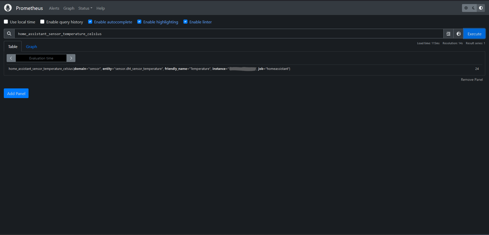

# Raspberry PI Home Automation

    &nbsp; &nbsp; &nbsp;
    
    &nbsp; &nbsp; &nbsp;
    
    &nbsp; &nbsp; &nbsp;
    
    &nbsp; &nbsp; &nbsp;
    
    &nbsp; &nbsp; &nbsp;
    
    &nbsp; &nbsp; &nbsp;
    
    &nbsp; &nbsp; &nbsp;
    
    &nbsp; &nbsp; &nbsp;
    
    &nbsp; &nbsp; &nbsp;  

## Description

This project uses a Raspberry Pi 3 Model B to create a smart home monitoring system. It includes features such as temperature/humidity alerts, DNS filtering with Pihole, data visualization with Grafana, and a local portal hosted on Nginx (and I plan to add more!).

## Table of Contents

- [Introduction](#introduction)
- [Project Structure](#project-structure)
    - [Why Docker? 🐳](#why-docker-🐳)
    - [How it Works?](#how-it-works)
        - [Home Assistant](#home-assistant-keeping-an-eye)
        - [Pihole](#pihole-filtering-the-digital-noise)
        - [Grafana and Prometheus](#grafana-and-prometheus-turning-data-into-art)
        - [Nginx](#nginx-hosting-the-local-portal)
        - [Docker](#docker-bringing-harmony)
- [Hardware Setup](#hardware-setup)
    - [Raspberry Pi Model 3 B](#raspberry-pi-3-model-b)
    - [DHT11 Sensor](#dht-11-sensor)
- [Mobile Integration](#mobile-integration)
- [Future Additions](#future-additions)

## Introduction

In this project, I've transformed the simplicity of a Raspberry Pi 3 Model B and a basic temperature/humidity sensor into a smart home monitoring system. Despite minimal hardware, the goal was to create something impactful. Follow along as I guide you through the installation and setup, showcasing the potential of turning limitations into innovation. Let's explore how a modest setup can lead to an engaging journey in home automation.

## Project Structure

### Why Docker? 🐳

I went with Docker because it just makes things a lot simpler and practical:

**Isolation and Portability:**
You know how sometimes moving stuff around between different setups can be a headache? Docker containers neatly wrap up each service, so it's like packing them into boxes. Makes moving the entire setup between different environments a breeze.

**Easy Deployment:**
Setting up multiple things together can be a bit tricky, but Docker Compose acts like a magical single configuration file. It's like telling your computer, "Hey, run all these things together," and it just does it.

**Consistency:**
Imagine if your favorite recipe tasted different every time you cooked it. Docker ensures that your setup behaves the same way no matter where it's running. Less fuss, less tweaking.

**Resource Efficiency:**
Docker containers are like friendly roommates sharing a house. They all use the same kitchen (host OS kernel), so it's resource-efficient. No need for each of them to have their own kitchen!

**Community Support:**
It's like going to a supermarket where everything is ready to use. Docker Hub is this massive collection of pre-configured stuff. Need Grafana? Grab it from Docker Hub, and you're good to go.

So, using Docker is like having a personal assistant for managing and deploying all the bits and pieces of this **Raspberry Pi Home Automation** project. Makes things smooth and efficient! I LOVE it!

### How it Works?

Alright, let's break down the magic behind this Raspberry Pi Home Automation setup!

#### Home Assistant Keeping an Eye:
First up, we've got Home Assistant, your vigilant digital sidekick. It's constantly monitoring the temperature and humidity in your room. If things get too hot, too cold, or too humid for too long, it taps you on the virtual shoulder and says, "Hey, something's up!"

#### Pihole Filtering the Digital Noise:
Then, there's Pihole. Think of it as the bouncer of your online space. It filters through all the DNS requests, blocking the unwanted stuff and ensuring a smoother internet experience. No more annoying pop-ups or unwanted ads!

#### Grafana and Prometheus Turning Data into Art:
Grafana steps in to make your data look like a work of art. It takes all the information collected by Prometheus, the behind-the-scenes data keeper, and turns it into these beautiful dashboards. You can see at a glance how your room's conditions have been over time.

  

#### Nginx Hosting the Local Portal:
And finally, Nginx is like the doorman for your local portal. It hosts a website right there on your Raspberry Pi, giving you a one-stop-shop for all your services. Just type in http://localhost in your browser, and voilà, you have quick access to Home Assistant, Grafana, and more!

#### Docker Bringing Harmony:
Now, the secret sauce tying it all together is Docker. It's like having individual containers for each service, keeping them neatly organized and making sure they play well together. This makes deploying and managing everything a breeze.

## Hardware Setup

Here's a glimpse of the hardware I'm using for this project:

| Raspberry Pi 3 Model B | DHT 11 Sensor |
| :--------: | :--------: |
|  | 
| *My trusty Raspberry Pi 3 Model B* | *The DHT 11 sensor keeping tabs on the room conditions* |

### Raspberry Pi 3 Model B

Who would have thought that so much is possible from so little? Indeed, this RPi3B has been sleeping in my drawer for years and now, it has been improving my day to day life tremendously. 

How you ask? Well, now I can very easily monitor my room conditions, especially humidity, which is important to keep track of during winters. I will know when humidity is too high and will then open the windows, allowing me to live in a healthy, ventilated environment. This is of course good for my skin and lungs, while also greatly reducing the chance of mold or other unwanted bugs thriving in high humidity.

### DHT 11 Sensor

The DHT11 is a basic, ultra low-cost digital temperature and humidity sensor. More information can be found [here](https://www.adafruit.com/product/386).

## Mobile Integration

I have downloaded the Home Assistant App on my phone and now I am able to track the room conditions from my phone at a glance. The Alert function from Home Assistant allows me to receive notifications whenever the temperature or humidity reach critical values.

## Future Additions

With how fun this project turned out to be, I am looking to further improve with my Docker skills and expand on it. So much more is possible with this RPi3, and when I get more time and inspiration, I will definitely add new features and functionalities to my little Home Automation system.

Even if I don't have much, I felt like I have done quite a lot and I am very satisfied with that.

If you have any feedback or questions, feel free to contact me!